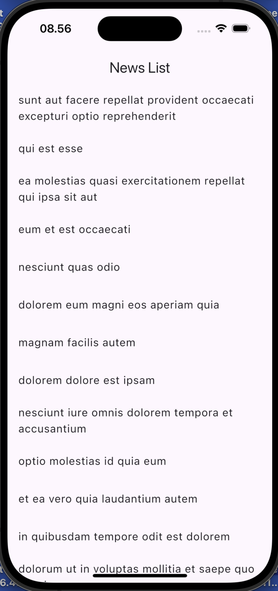
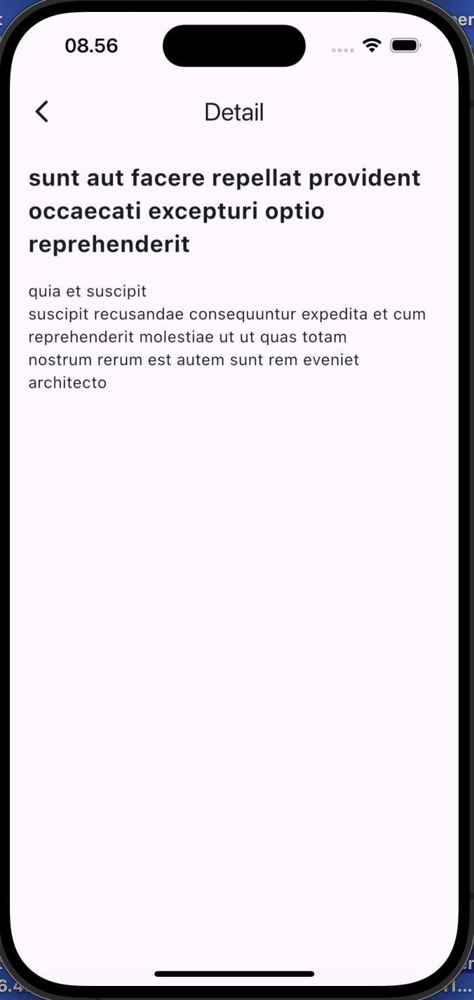

# 📰 Flutter News App (with GetX & API)

A simple Flutter news app that fetches articles from an API using **GetX** for state management and routing. Users can view a list of news articles, pull to refresh, and navigate to a detail screen.

---

## 🚀 Features

- ✅ GetX for state management and navigation
- ✅ Fetch news from a remote API (jsonplaceholder.typicode.com)
- ✅ Swipe to refresh
- ✅ Clean architecture: Model → Controller → View

---

## 📦 Dependencies

Add these to your `pubspec.yaml`:

```yaml
dependencies:
  flutter:
    sdk: flutter
  get: ^4.6.6
  http: ^0.13.6
```

## 📁 Folder Structure
lib/
├── controllers/
│   └── news_controller.dart
├── models/
│   └── news_model.dart
├── pages/
│   ├── home_page.dart
│   └── detail_page.dart
└── main.dart

## 🔗 API Used
https://jsonplaceholder.typicode.com/posts

This API returns mock post data with title and body fields.

## 📸 Screenshots
Home Page | Detail Page | 
 |  |

